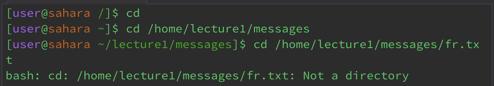
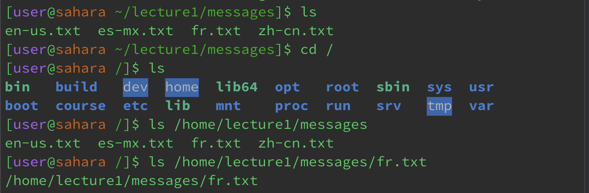
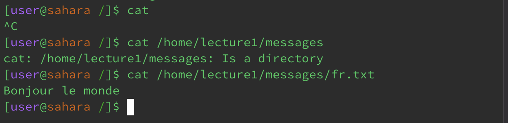

# Lab Report 1 - Norman Lee

## cd command

* The working directory was */* or the *root* directory. From this directory, running cd without arguments changes the directory to *~* or *home*. This is not an error since running cd with no arguments changes the directory to the *home* directory regardless of the current working directory. With the working directory being the *home* directory, running cd without any arguments did not change the directory. This is not an error because cd returned the current working directory which is the *home* directory. 
* The working directory was the *home* directory. Using cd with a path to the *messages* directory changed the working directory to the *messages* directory. This is not an error because that was the expected result.
* The working directory was the *messages* directory. Using cd with a path to the *fr.txt* file returned an error because cd is used to change directories and *fr.txt* is not a directory, it is a file. This is not an error because the expected result of using cd with a path to a file would be an error.

## ls command

* I showed two examples of using ls with no arguments. The first was with the working directory being the *messages* directory. Using ls without arguments returned the files in the *messages* directory, which is not an error because the intention was for all the files to be listed in the *messages* directory. The other example was the working directory being the *root* directory. Using ls with no arguments listed the files and directories in the current working directory, which was the *root* directory. This is not an error because the expectation is to list all the files of the *root* directory.
* The working directory was the *root* directory. Using ls with a path to the *messages* directory listed the files within that directory. This is not an error because ls did as intended and listed all the files of the *messages* directory.
* The working directory was the *root* directory. Using ls with a path to the *fr.txt* file returned the path to that file because that is the location of the file. This is not an error because ls listed the file *fr.txt*. The output changes based on the path that is provided, in that, a path to a directory will return the files of that directory while a path to a file will return the path to that file.
## cat command

* The working directory is the *root* directory. Using cat with no arguments returned an empty line, which required exiting out of that command line because there was no content to print out nor a path to a file. This is not an error because there are no arguments to print. If the user were to type something and hit enter after running cat with no arguments such as "bird", the next command line will print bird. This is not an error because cat with no arguments wants an argument and typing "bird" becomes the argument so it prints it.
* The working directory is the *root* directory. Using cat with a path to the *messages* directory returned the path and that it was a directory because cat is used to print the contents of files, not directories. This is not an error because cat printed the argument, which happened to be the directory path. This is similar to the previous example of using "bird" except it was "/home/lecture1/messages" instead. It could be an error because "Is a directory" is included in the print line, which goes against expectations.
* The working directory is the *root* directory. Using cat with a path to the *fr.txt* file printed "Bonjour le monde" because that was the content of the file. This is not an error because it did the expected result of printing the contents of the *fr.txt* file.
