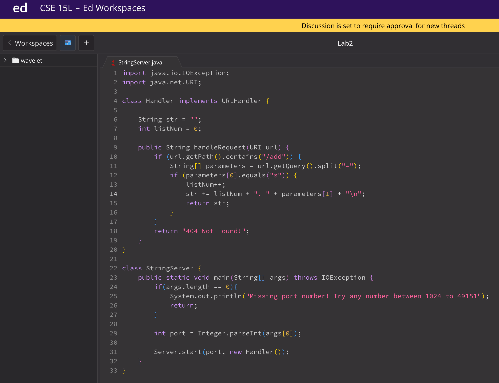
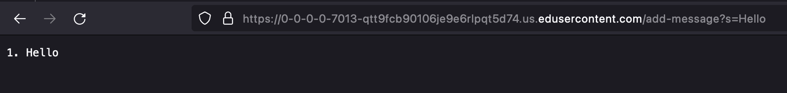
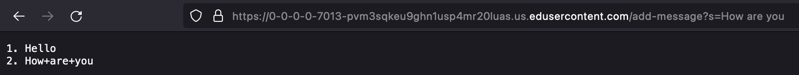
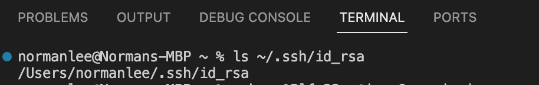
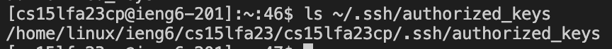
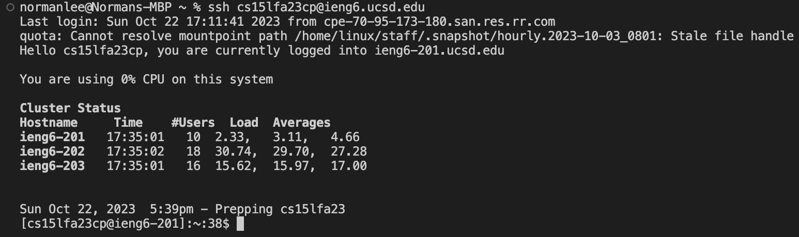

# Lab Report 2 - Norman Lee

For each of the two screenshots, describe:

    Which methods in your code are called?
    What are the relevant arguments to those methods, and the values of any relevant fields of the class?
    How do the values of any relevant fields of the class change from this specific request? If no values got changed, explain why.

By values, we mean specific Strings, ints, URIs, and so on. "abc" is a value, 456 is a value, new URI("http://...") is a value, and so on.)
Part 2

## Part 1

* With the request being */add-message?s=Hello*, the handleRequest method is called in the Handler class. The relevant arguments include */add-message?s=Hello* for URI url as url.getPath() is */add-message* and url.getQuery() is *s=Hello*.  The values of any relevant fields include the empty string ("") for String str and 0 for int listNum. The values change from this specific request with str updating to *1. Hello \n* and listNum incrementing by 1 to become 1.

* With the request being */add-message?s=How are you*, the handleRequest method is called in the Handler class. The relevant arguments include */add-message?s=How are you* for URI url as url.getPath() is */add-message* and url.getQuery() is *s=How are you*.  The values of any relevant fields include *1. Hello \n* for String str and 1 for int listNum. The values change from this specific request with str updating to *1. Hello \n 2. How are you \n* and listNum incrementing by 1 to become 2.

## Part 2

## Part 3

* In lab for Week 2 and 3, I have learned how to utilize the *ssh* command to remote connect to a school server. In addition, I manipulated servers with the URL requests. Lastly, I learned new commands like mkdir and scp, which allowed me to store my password into ssh keys so I wouldn't have to type my password each time I login to my remote account. 

