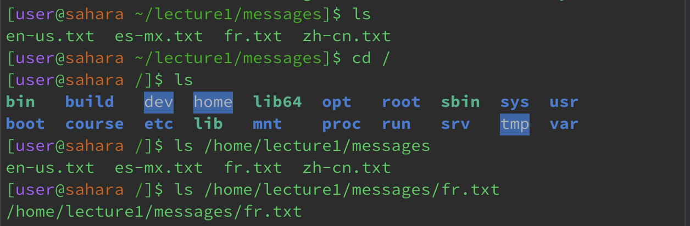

# Lab Report 2 - Norman Lee

## Part 1

* The working directory was */* or the *root* directory. From this directory, running cd without arguments changes the directory to *~* or *home*. This is not an error since running cd with no arguments changes the directory to the *home* directory regardless of the current working directory. With the working directory being the *home* directory, running cd without any arguments did not change the directory. This is not an error because cd returned the current working directory which is the *home* directory. 
* The working directory was the *home* directory. Using cd with a path to the *messages* directory changed the working directory to the *messages* directory. This is not an error because that was the expected result.
* The working directory was the *messages* directory. Using cd with a path to the *fr.txt* file returned an error because cd is used to change directories and *fr.txt* is not a directory, it is a file. This is not an error because the expected result of using cd with a path to a file would be an error.

## Part 2

## Part 3

