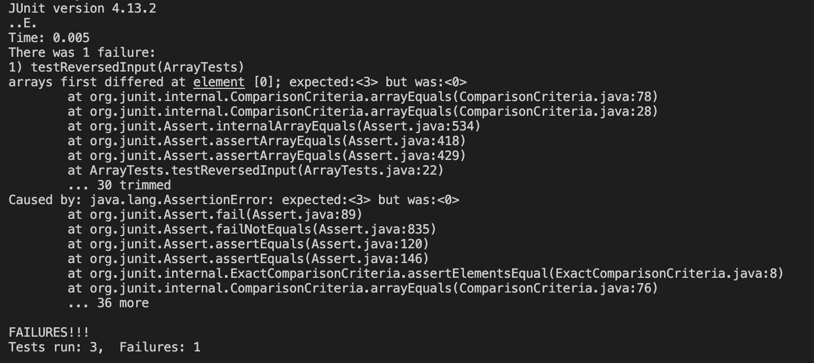
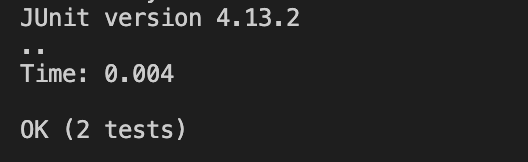

# Lab Report 3 - Norman Lee

## Part 1 - Bugs

* A failure-inducing input for the buggy program, as a JUnit test and any associated code (write it as a code block in Markdown)

```
 @Test
  public void testReversedInput() {
    int[] input1 = {1, 2, 3};
    assertArrayEquals(new int[]{3, 2, 1}, ArrayExamples.reversed(input1));
  }
```

* An input that doesn’t induce a failure, as a JUnit test and any associated code (write it as a code block in Markdown)

```
@Test
  public void testReversed() {
    int[] input1 = { };
    assertArrayEquals(new int[]{ }, ArrayExamples.reversed(input1));
  }
```

* The symptom, as the output of running the tests (provide it as a screenshot of running JUnit with at least the two inputs above)

Failure-inducing input:



Input that doesn't induce a failure:



* The bug, as the before-and-after code change required to fix it (as two code blocks in Markdown)

Before:
```
static int[] reversed(int[] arr) {
    int[] newArray = new int[arr.length];
    for(int i = 0; i < arr.length; i += 1) {
      arr[i] = newArray[arr.length - i - 1];
    }
    return arr;
  }
```

After:
```
static int[] reversed(int[] arr) {
    int[] newArray = new int[arr.length];
    for(int i = 0; i < arr.length; i += 1) {
      newArray[i] = arr[arr.length - i - 1];
    }
    return newArray;
  }
```

The fix adds the elements in 'arr' into 'newArray' in reversed order and returns the 'newArray'.


## Part 2 - Researching Commands
