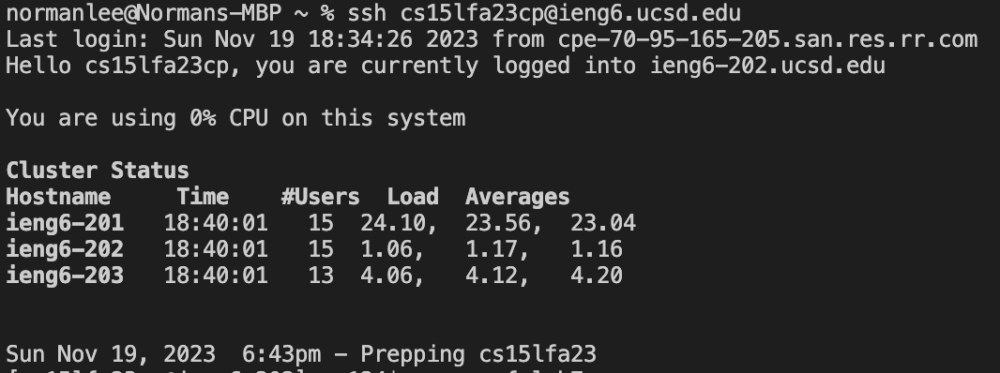

# Lab Report 4 - Norman Lee

## Step 4 - Log into ieng6



**Exact Keys:** 
```
<up><Enter>
```

The ssh cs15lfa23cp@ieng6.ucsd.edu command was 1 up in the search history, so I used up arrow to access it. 

## Step 5 -Clone your fork of the repository from your Github account (using the SSH URL)


**Exact Keys:** 
```
<up><Enter>
```

The git clone git@github.com:normanlee8/lab7.git command was 1 up in the search history, so I used up arrow to access it. 

## Step 6 - Run the tests, demonstrating that they fail


**Exact Keys:** 
```
cd lab7<Enter>
bash test.sh<Enter>
```

I typed cd lab7 to change directories and bash test.sh to run the tests. I didn't use any commands since it was quick to type.

## Step 7 - Edit the code file to fix the failing test


**Exact Keys:** 
```
vim L<tab>.<tab><Enter>
jjjxi2<ESC>:wq<Enter>
```

I accessed the vim ListExamples.java command by typing vim L then used tab to autofill the rest of file name then . and tab again to autofill the rest. From where I was in the editor, I used j 3 times to have my cursor at the 1 in index1. Then I used x to delete the 1 and i to insert 2. Afterwards, I hit ESC to return to normal mode and typed :wq to save changes.

## Step 8 - Run the tests, demonstrating that they now succeed


**Exact Keys:** 
```
<up><up><Enter>
```

The bash test.sh command was 2 up in the search history so I used up arrow twice to access it.

## Step 9 - Commit and push the resulting change to your Github account (you can pick any commit message!)


**Exact Keys:**
```
git add L<tab><Enter>
git commit -m "fixed"<Enter>
git push origin main<Enter>
```

I typed git add L and used tab to autofill the rest of the file name (ListExamples.java). Afterwards, I typed git commit -m "fixed", followed by git push origin main.
